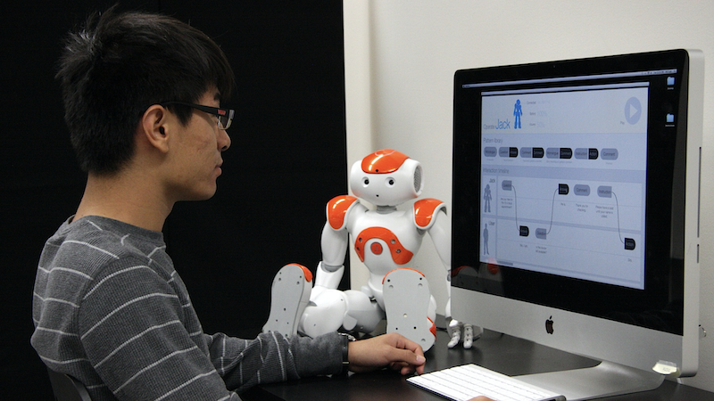
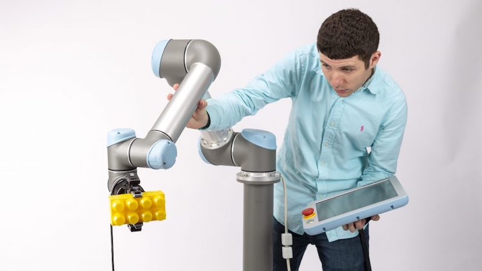
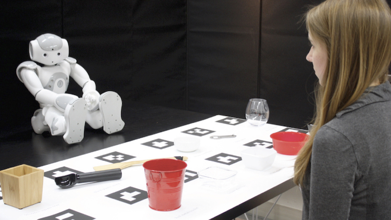

I am *Sheldon B. and Marianne S. Lubar Professor* of [Computer Science](http://cs.wisc.edu/), [Psychology](http://psych.wisc.edu/), and [Industrial Engineering](http://www.engr.wisc.edu/isye.html) at the [University of Wisconsin–Madison](http://wisc.edu/), at Discovery Fellow at the [Wisconsin Institute for Discovery](https://wid.wisc.edu/) and the director of the [People and Robots Laboratory](http://peopleandrobots.wisc.edu/). I received my PhD degree from [Carnegie Mellon University](http://cmu.edu/)‘s [Human-Computer Interaction Institute](http://hcii.cs.cmu.edu/) in 2009.

I served as the founding chief editor of the [HRI section of the journal Frontiers in Robotics & AI](https://www.frontiersin.org/journals/robotics-and-ai/sections/human-robot-interaction#). If you are an HRI researcher interested in publishing in a rigorous, open-access venue, please submit! I also serve as an associated editor at [Human-Computer Interaction](https://www.tandfonline.com/toc/hhci20/current) and [Foundations and Trends® in Human-Computer Interaction](https://www.nowpublishers.com/HCI) and the secretary-treasurer of the [HCI Consortium](http://hcic.org/).

I am the director of the [INTEGRATE](https://integrate.wisc.edu) NSF Research Traineeship program, a new interdisciplinary program designed to enrich the training of graduate student on the technical and societal facets of introducing robots into work environments. UW students from any graduate program can apply and join the [INTEGRATE Community](https://integrate.wisc.edu/seminars/)!

If you are interested in joining the [People and Robots Lab](http://peopleandrobots.wisc.edu), please read [this page](/joining).

<strong><a href="https://drive.google.com/file/d/10dYMhbmAQqMcagQlS8GAHVbamjY6_P8P/view?usp=sharing" target="_blank">Download my CV</a></strong> — _Updated: August 2024_

<highlight>In the 2024–2025 Academic Year, I will be on sabbatical. In this period, communication may be slow, and I am unable accept requests for review or meeting requests beyond my students and collaborators. Thank you for understanding!</highlight>

## Research

My research in [human-robot interaction (HRI)](https://en.wikipedia.org/wiki/Human–robot_interaction) builds human-centered principles and methods to enable effective and intuitive interactions between people and robotic technologies and facilitate the successful integration of these technologies into human environments. Below are highlights from ongoing projects in the [People and Robots Lab](http://peopleandrobots.wisc.edu/).

|  |  |
| :-: | :-: |
| **[HRI Design Tools](/portfolio/portfolio-1)** | **[Human-Robot Collaboration](/portfolio/portfolio-2)** | 
|  |  |
| **[Building Social Companions](/portfolio/portfolio-3)** | **[Supporting Social Participation](/portfolio/portfolio-4)** |

## Videos & Talks

<table>
    <tr>
      <td class="style24" style="width: 400px">
        

          <iframe src="https://www.youtube.com/embed/mkq3Zn3tVvc?si=xJSOsx50AVAyqJv-" title="YouTube video player" frameborder="0" allow="accelerometer; autoplay; clipboard-write; encrypted-media; gyroscope; picture-in-picture; web-share" allowfullscreen></iframe>
          

      </td>
      <td class="style24" style="width: 400px">
            

                <iframe src="https://www.youtube.com/embed/videoseries?list=PLaIgLiq4gIuaA60oLfWalDrM91oA75mO-" title="YouTube video player" frameborder="0" allow="accelerometer; autoplay; clipboard-write; encrypted-media; gyroscope; picture-in-picture; web-share" allowfullscreen></iframe>
            

        </td>
    </tr>
    <tr>
    <td class="style24" style="width: 400px">
        

          <iframe src="https://www.youtube.com/embed/w2gu54f4tIU?si=7EQwdugrtbXKqFvP&amp;start=610" title="YouTube video player" frameborder="0" allow="accelerometer; autoplay; clipboard-write; encrypted-media; gyroscope; picture-in-picture; web-share" allowfullscreen></iframe>
          

      </td>
        <td class="style24" style="width: 400px">
            

                <iframe src="https://www.youtube.com/embed/videoseries?list=PLaIgLiq4gIuZykeHKBJFIYl4VZZ2PcZQc" title="YouTube video player" frameborder="0" allow="accelerometer; autoplay; clipboard-write; encrypted-media; gyroscope; picture-in-picture; web-share" allowfullscreen></iframe>
            

        </td>
    </tr>
</table>

## Teaching

I teach undergraduate and graduate classes on human-computer interaction, user experience design, and research methods. Below are courses that I am currently teaching or have taught in the last year.

|  |  |
| :-: | :-: |
| **[Building User Interfaces](/teaching/teaching-1)** | **[Building Interactive Systems](/teaching/teaching-3)** |

## Advising

I work with a fantastic group of advisees who come from a diverse set of background including computer science, industrial design, industrial engineering, and history who are already building their own research programs. If you are interested in working with me, please read [this page](/joining/).

### Current Advisees
- [Sophie Wohltjen](https://www.linkedin.com/in/sophie-wohltjen-9b12b351), Postdoctoral Researcher
- [Arissa Sato](https://arissasato.com), Postdoctoral Researcher
- [Laura Stegner](https://www.laurastegner.com/), CS Graduate Student
- [Bengisu Cagiltay](https://bengisucagiltay.github.io/), CS Graduate Student
- [Nathan White](https://nathantwhite.com/), CS Graduate Student
- [Christine Lee](https://christineplee.github.io/), CS Graduate Student
- [Amy Koike](https://amykoike.notion.site/amykoike/Amy-Koike-s-Portfolio-25f2b3e0429e498183aa739b193fda01), CS Graduate Student
- [Yaxin Hu](https://www.edayaxin.com/about), CS Graduate Student
- [Dakota Sullivan](https://dakotasullivan.github.io/), CS Graduate Student
- [Hailey Johnson](https://haileyljohnson.github.io/), CS Graduate Student
- [Callie Kim](https://callie-kim.com/), CS Graduate Student
- [Yuna Hwang](https://yunahwang.github.io/), CS Graduate Student
- [Michael Xu](http://www.michaelfxu.com/), CS Graduate Student
- [Irene Ho](https://edpsych.education.wisc.edu/staff/ho-hui-ru/), Ed Psych Graduate Student
- [Leo Cui](https://wid.wisc.edu/people/leo-cui/), CS Graduate Student

### Past Advisees
- [Emmanuel Senft](https://emmanuel-senft.github.io/), Postdoctoral Advisee, Idiap Research Institute
- [Hajin Lim](https://www.hajinlim.com/), Postdoctoral Advisee, Seoul National University
- [Andrew Schoen](https://andrewjschoen.github.io/), PhD Advisee, Semio
- [Pragathi Praveena](https://pragathipraveena.com/), PhD Advisee, Carnegie Mellon University
- [Danny Rakita](https://dannyrakita.net/), PhD Advisee, Yale University
- [Mike Hagenow](https://www.hageneaux.com/), Informal Advisee, MIT CSAIL
- [Olivia Zhao](https://www.olivia-zhao.com/), PhD Advisee, META
- [David Porfirio](https://dporfirio.github.io/), PhD Advisee, U.S. Naval Research Laboratory
- [Sean Andrist](https://seanandrist.com/), PhD Advisee, Microsoft Research
- [Joseph Michaelis](https://jmich.people.uic.edu/), PhD Advisee, University of Illinois Chicago
- [Tomislav Pejsa](https://www.linkedin.com/in/tomislav-pejsa/), PhD Advisee, Meta
- [Chien-Ming Huang](https://www.cs.jhu.edu/~cmhuang/), PhD Advisee, Johns Hopkins University
- [Daniel Szafir](https://www.danszafir.com/), PhD Advisee, University of North Carolina Chapel Hill
- [Allison Sauppé](https://cs.uwlax.edu/~asauppe/), PhD Advisee, University of Wisconsin–La Crosse
- [Irene Rae](https://www.linkedin.com/in/irenerae/), PhD Advisee, Google, Inc.
- [Shadeequa Miller](https://www.linkedin.com/in/sdeemiller/), PhD Advisee, Visa
- [Kevin Welsh](https://www.linkedin.com/in/kevin-welsh-668140bb), MS Advisee, Los Alamos National Labs
- [Curt Henrichs](https://www.linkedin.com/in/curt-henrichs/), MS Advisee, Integrated Dynamic Electron Solutions, Inc.
- [Margaret Pearce](https://www.linkedin.com/in/margaretpearce/), MS Advisee, Deepfield
- [Steven Johnson](https://www.linkedin.com/in/steven-johnson-590274ba/), MS Advisee, Google, Inc.
- [Christopher Bodden](https://dblp.org/pid/190/3029.html), MS Advisee, Software Engineer
- [Faisal Khan](https://www.linkedin.com/in/faisalkhan83/), MS Advisee, Argonne National Lab
- [Erica (Lewis) Martin](https://www.linkedin.com/in/erica-martin-lewis-866080a5/), BS Advisee, Microsoft
- Nathalie Cheng, BS Advisee, Exygy
- [Jonathan Mumm](https://www.linkedin.com/in/jonathanrmumm/), BS Advisee, hims & hers
- [Zhi Tan](https://www.khoury.northeastern.edu/people/zhi-tan/), BS Advisee, Northeastern University
